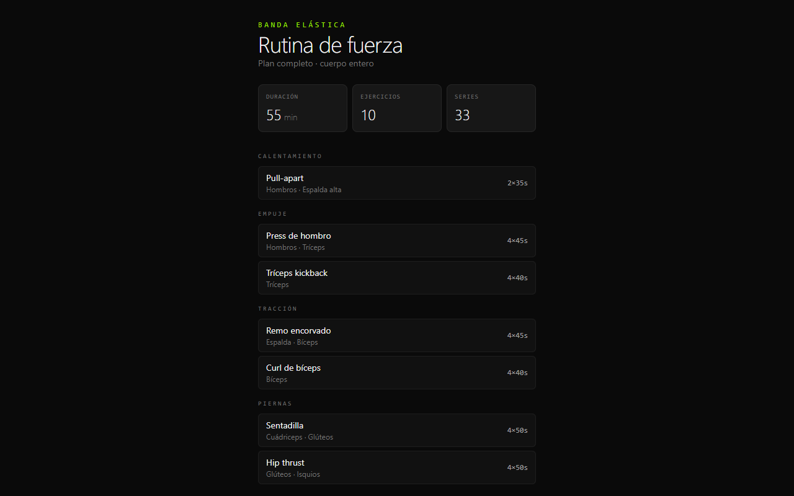
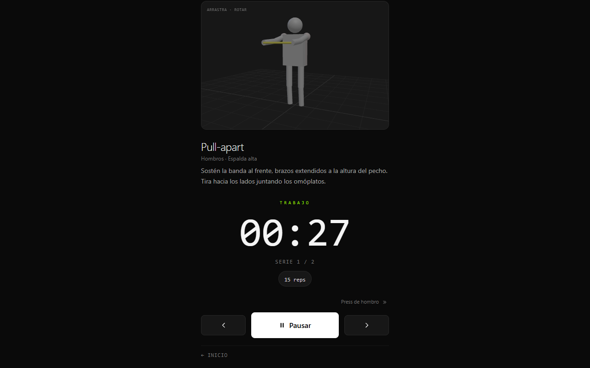

# Rutina de Fuerza con Elásticos

Strength-training routine app for **flat open resistance bands** (therapy bands — long flat strips, no handles). Designed to train the major muscle groups and help maintain endurance. UI is in Spanish.

Every exercise is rendered in 3D with an animated skeleton, and the band is drawn with tension-reactive color (lime → red as it stretches).





## Stack

- **Vite 6** + **React 19**
- **Tailwind CSS v4** (via `@tailwindcss/vite`)
- **Three.js** (scene built by hand, no `OrbitControls`)
- **Bun** as runtime and package manager

## Commands

```bash
bun install        # install dependencies
bun run dev        # dev server at http://localhost:5173
bun run build      # production build to dist/
bun run preview    # serve the built bundle
```

## Structure

```
src/
├── data/
│   ├── poses.js         # poses as flat dicts of joint angles (radians)
│   ├── exercises.js     # exercises: keyframes, duration, band config
│   └── routine.js       # ordered routine (sets, work, rest, reps, phase)
├── state/
│   └── workoutReducer.js  # state machine work → rest → … → complete
├── three/
│   ├── skeleton.js      # skeleton construction + pose application
│   └── bandRenderer.js  # band renderer (4 anchor types)
├── components/
│   ├── StartScreen.jsx
│   ├── WorkoutScreen.jsx
│   ├── CompleteScreen.jsx
│   └── ExerciseViewer.jsx  # only consumer of Three.js
├── App.jsx              # routing via reducer flags + 100ms tick
└── main.jsx
```

Three layers: **data → engine → UI**. Adding an exercise touches all three but is mostly data work.

## Supported band types

Each exercise declares a `band.type`:

- `handToHand` — single segment between the two hands.
- `footToHand_dual` — two segments, one per side (foot → hand).
- `overhead_to_feet` — single segment from mid-hands to mid-feet.
- `anchored_side` — fixed anchor mesh + segment to mid-hands. Requires `anchorPos: [x, y, z]`.

## Adding an exercise

1. Define start/end poses in `src/data/poses.js` (use the `d()` helper for degrees → radians; keep the joint key set consistent).
2. Add an entry to `EXERCISES` with `keyframes` (usually `[start, end, start]`), `duration` (seconds per cycle in the viewer), and a valid `band` config.
3. Append a row to `ROUTINE` with `sets`, `workSec`, `restSec`, `reps`, and `phase` (free-form Spanish string used to group exercises on the start screen).

If a movement needs a new pose shape, prefer extending an existing pose rather than duplicating — many poses are shared across exercises.

## Language

All user-facing copy in the app is in Spanish, it is intended for Spanish-speaking users.
